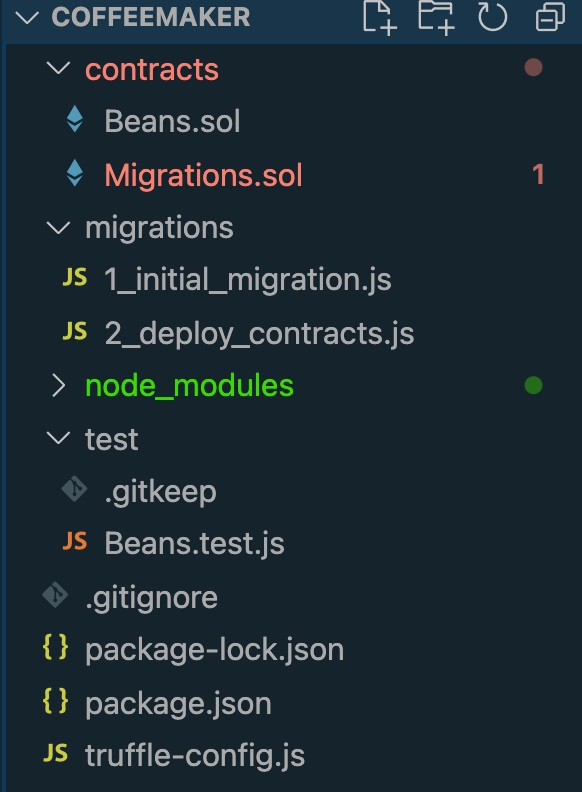
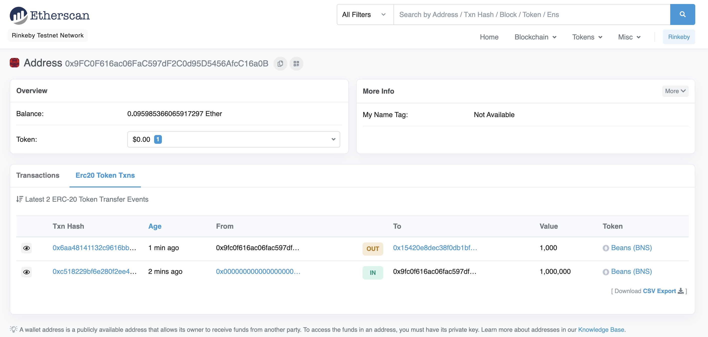

# Beans (BNS)
## ERC20 Token For NYCU Coffee Club

Hello there! I’m **Hong, Kai-Yin**, ECE student from NYCU!!

0710851 / ECE 4C

---

## Step by step

### Initialize Project
1 . Create a directory name "coffeemaker"

2 . Initialize the project

```
truffle init
```
---
### Environment Setting
1 . Import openzepplin

```
npm install @openzeppelin/contracts --save
```

2. import Metamask support

```
npm install @truffle/hdwallet-provider
```
---
### File structure

---
### TDD Development
#### Create test cases first before dive into developent.
 - Check if creator have 1M BNS token after deploying smart contract.
 - Check if receivor get 1000 BNS token after transfering token.

```
const Beans = artifacts.require("Beans")

contract("Beans", (accounts) => {

    before(async () => {
        beans = await Beans.deployed()
        console.log("Beans Address: ", beans.address)
    })

    it("gives the owner of the token 1M tokens", async () => {
        let balance = await beans.balanceOf(accounts[0])
        balance = web3.utils.fromWei(balance, 'ether')
        assert.equal(balance, 1000000, "Balance should be 1M tokens for contract creator")
    })

    it("can transfer tokens between accounts", async () => {
        let amount = web3.utils.toWei('1000', 'ether')
        await beans.transfer(accounts[1], amount, { from: accounts[0] })

        let balance = await beans.balanceOf(accounts[1])
        balance = web3.utils.fromWei(balance, 'ether')
        assert.equal(balance, '1000', "Balance should be 1k tokens for contract creator")
    })
})
```
#### Useful commandline

```
truffle test

```
```
truffle test --network rinkeby
```
---
### ERC20 token

#### Beans is inherited from ERC20.sol from Openzeppelin library!
##### Interface of the ERC20 standard
- 6 Functions:
	- totalSupply()
	- balanceOf(account)
	- transfer(recipient, amount)
	- allowance(owner, spender)
	- approve(spender, amount)
	- transferFrom(sender, recipient, amount)
- 2 Events:
	- Transfer(from, to, value)
	- Approval(owner, spender, value)

```
// SPDX-License-Identifier: MIT
pragma solidity 0.8.4;

import "@openzeppelin/contracts/token/ERC20/ERC20.sol";

contract Beans is ERC20 {

    constructor(uint256 _supply) ERC20("Beans", "BNS") {   
        _mint(msg.sender, _supply * (10 ** decimals()));
    }

}
```
##### [Notice] Decimals should be added in codes, since native Ethereum only support integer number of tokens.
---
### Deployment
```
truffle test --network rinkeby
```



```
truffle deploy --network rinkeby 
```
---
