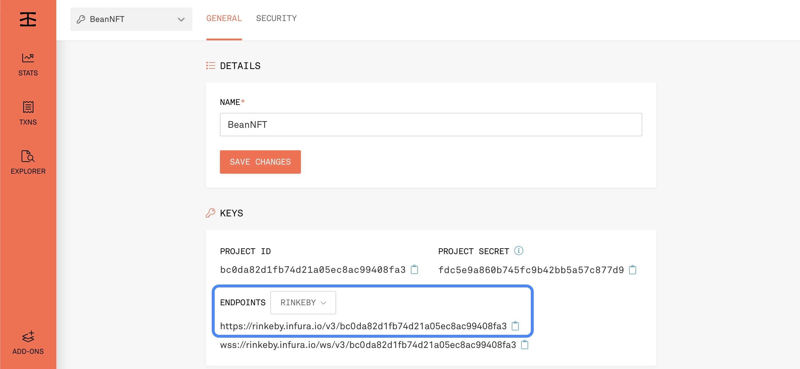
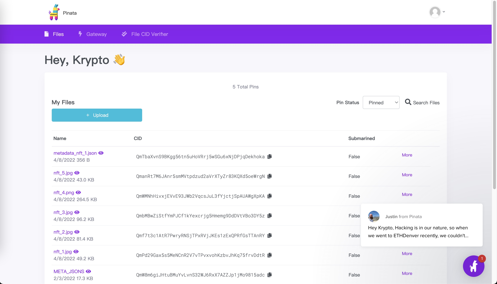
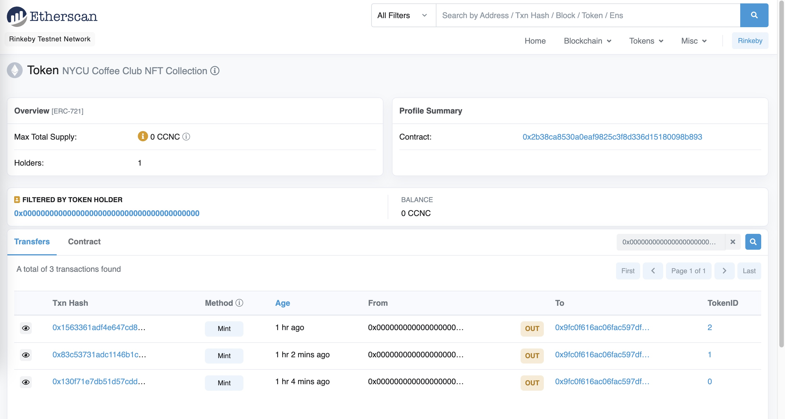
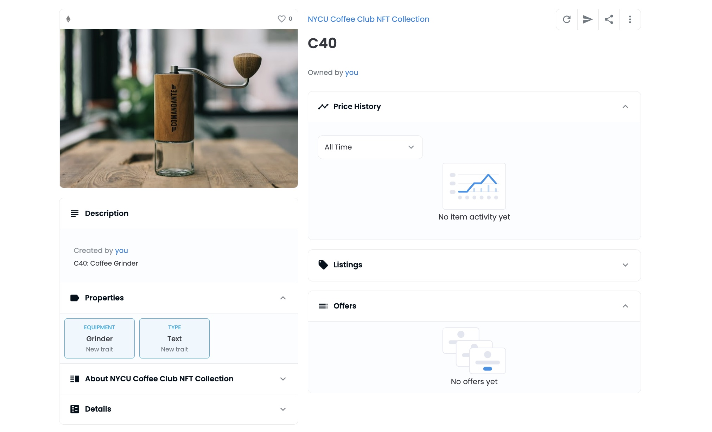
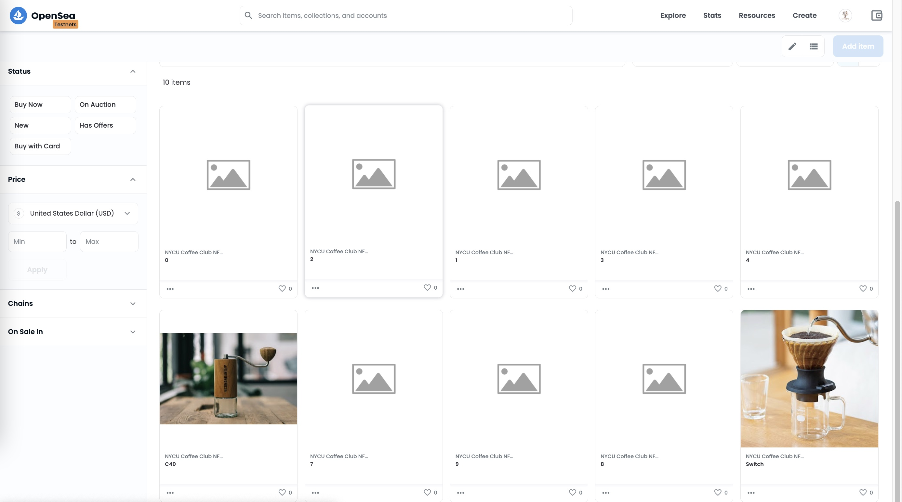

# BeanNFT
	NYCU Coffee Club NFT

Hello there! I’m **Hong, Kai-Yin**, ECE student from NYCU!!

0710851 / ECE 4C


### Environment Setting
Import openzepplin

```
npm install @openzeppelin/contracts --save
```

import Metamask support

```
npm install @truffle/hdwallet-provider
```

### Truffle Usage

```
truffle init

```
```
truffle compile
```
```
truffle migrate --network rinkeby
(or) truffle deploy --network rinkeby

```

### ERC721 Non-fungible token

#### BeanNFT is inherited from ERC721URIStorage.sol from Openzeppelin library!
##### ERC721URIStorage 
- is an implementation of ERC721 that includes the metadata standard extensions (IERC721Metadata) as well as a mechanism for per-token metadata. That’s where the _setTokenURI method comes from: we use it to store an item’s metadata.
- a more flexible but more expensive way of storing metadata.

```
// SPDX-License-Identifier: MIT
pragma solidity ^0.8.4;

import "@openzeppelin/contracts/token/ERC721/extensions/ERC721URIStorage.sol";
import "@openzeppelin/contracts/utils/Counters.sol";

contract BeanNFT is ERC721URIStorage{
    using Counters for Counters.Counter;
    Counters.Counter private _tokenIds;

    event CreatedNFT(uint256 indexed tokenId, string tokenURI);

    constructor() ERC721("NYCU Coffee Club NFT Collection", "CCNC") {}

    function mint(string memory _tokenURI) public returns (uint256) {
       uint256 newItemId = _tokenIds.current();
       _safeMint(msg.sender, newItemId);
       _setTokenURI(newItemId, _tokenURI);
       emit CreatedNFT(newItemId, _tokenURI);
       _tokenIds.increment();

       return newItemId;
    }
}
```

### Deploy contract to Rinkeby network through Infura endpoint 


truffle.config.js

```
rinkeby: {
      provider: () => new HDWalletProvider(RINKEBY.PRIVATE_KEY, RINKEBY.INFURA_URI),

      network_id: 4,
      gas: 5500000,        
      confirmations: 2,    
      timeoutBlocks: 200,
      skipDryRun: true   
    },
    
```
secret.json

```
{
    "RINKEBY":
    {
        "PRIVATE_KEY" : "YOUR_METAMASK_PRIVATE_KEY",
        "INFURA_URI" : "https://rinkeby.infura.io/v3/bc0da82d1fb74d21a05ec8ac99408fa3"
    }      
}
```

### Upload images and metadata to IPFS through Pinata

Metadata should follow Opensea format

```
{
    "attributes":[
        {
            "trait_type": "Equipment",
            "value": "Grinder"
        },
        {
            "trait_type": "Type",
            "value": "text"
        }
    ],
    "description": "C40: Coffee Grinder ",
    "image": "https://ipfs.io/ipfs/QmPd29Gax5s5MeNCnR2V7vTPvxvohKzbvJhKq75frvDdtR",
    "name": "C40"
}

```


### How to Mint NFT
Enter truffle console by typing

```
truffle console
```

Mint NFT by Metadata's CID

```
truffle(rinkeby)> beanNFT = await BeanNFT.deployed()
undefined
truffle(rinkeby)> await beanNFT.mint("http://ipfs.io/ipfs/QmQo3YQhAPjwjsA1awSLodxn2uFPxnE2mjYpAB3HXt2XvU")
```
Success if status show true

```
{
  tx: '0x130f71e7db51d57cdd7199467849f084ac8310f4d8903f9257acbdf7e447e1aa',
  receipt: {
    blockHash: '0xd53c6c9a6ee40e307b2c67b5754a37246eddc17e96e2acdd6a6679287d2fc7ba',
    blockNumber: 10468662,
    contractAddress: null,
    cumulativeGasUsed: 659800,
    effectiveGasPrice: '0x9502f90f',
    from: '0x9fc0f616ac06fac597df2c0d95d5456afcc16a0b',
    gasUsed: 186146,
    logs: [ [Object], [Object] ],
    logsBloom: '0x00000000000000000000000000002000000000000000000000000000000000008000000000000000020000000000000000000000000000000000000000000000000000000000000000400008000000000000000000000000000000000000000000000000020000000000000000000800000000000000000000000010000000000000000000000000000000000000000000000000040000000000000000000000000000000000000000000000000000000000000100000000000000000800000000001002000000000000000000000000000000000000000000000000000020000000000000000000000000000000000800000000000000000000000000000000',
    status: true,
    to: '0x2b38ca8530a0eaf9825c3f8d336d15180098b893',
    transactionHash: '0x130f71e7db51d57cdd7199467849f084ac8310f4d8903f9257acbdf7e447e1aa',
    transactionIndex: 5,
    type: '0x2',
    rawLogs: [ [Object], [Object] ]
  },
  logs: [
    {
      address: '0x2B38Ca8530a0EaF9825c3F8D336D15180098B893',
      blockHash: '0xd53c6c9a6ee40e307b2c67b5754a37246eddc17e96e2acdd6a6679287d2fc7ba',
      blockNumber: 10468662,
      logIndex: 5,
      removed: false,
      transactionHash: '0x130f71e7db51d57cdd7199467849f084ac8310f4d8903f9257acbdf7e447e1aa',
      transactionIndex: 5,
      id: 'log_4e08c013',
      event: 'Transfer',
      args: [Result]
    },
    {
      address: '0x2B38Ca8530a0EaF9825c3F8D336D15180098B893',
      blockHash: '0xd53c6c9a6ee40e307b2c67b5754a37246eddc17e96e2acdd6a6679287d2fc7ba',
      blockNumber: 10468662,
      logIndex: 6,
      removed: false,
      transactionHash: '0x130f71e7db51d57cdd7199467849f084ac8310f4d8903f9257acbdf7e447e1aa',
      transactionIndex: 5,
      id: 'log_d8495a26',
      event: 'CreatedNFT',
      args: [Result]
    }
  ]
}
```
### Result




### Reference
- [medium](https://medium.com/gft-engineering/creating-your-own-nft-from-scratch-and-listing-it-on-opensea-8ac296cf1019)
- [atomicobject](https://spin.atomicobject.com/2021/10/19/nft-contract-factory-ipfs/)
- [youtube](https://www.youtube.com/watch?v=8-afKh4-0ls&ab_channel=EtishaGarg)